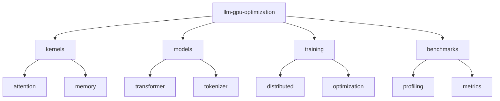

# LLM GPU Optimization 🚄

[](https://developer.nvidia.com/cuda-toolkit)
[](https://www.python.org/downloads/)
[](https://pytorch.org/)
[](LICENSE)
[](CONTRIBUTING.md)

> Advanced LLM optimization techniques using CUDA. Features efficient attention mechanisms, custom CUDA kernels for transformers, and memory-efficient training strategies.

[Features](#features) • [Installation](#installation) • [Quick Start](#quick-start) • [Documentation](#documentation) • [Contributing](#contributing)

## 📑 Table of Contents
- [Features](#features)
- [Project Structure](#project-structure)
- [Prerequisites](#prerequisites)
- [Installation](#installation)
- [Quick Start](#quick-start)
- [Documentation](#documentation)
  - [Optimizations](#optimizations)
  - [Memory Management](#memory-management)
  - [Benchmarks](#benchmarks)
- [Contributing](#contributing)
- [Versioning](#versioning)
- [Authors](#authors)
- [Citation](#citation)
- [License](#license)
- [Acknowledgments](#acknowledgments)

## ✨ Features
- Flash Attention implementation
- Efficient KV-cache management
- Custom CUDA kernels for attention
- Memory-efficient transformer layers
- Multi-GPU training optimization

## 📁 Project Structure



<details>
<summary>Click to expand full directory structure</summary>

```plaintext
llm-gpu-optimization/
├── kernels/           # CUDA kernel implementations
│   ├── attention/    # Optimized attention mechanisms
│   └── memory/      # Memory management utilities
├── models/           # Model implementations
│   ├── transformer/ # Transformer architecture
│   └── tokenizer/   # Tokenization optimizations
├── training/         # Training utilities
│   ├── distributed/ # Multi-GPU training
│   └── optimization/# Training optimizations
├── benchmarks/       # Performance benchmarks
└── README.md         # Documentation
```
</details>

## 🔧 Prerequisites
- CUDA Toolkit 11.8+
- NVIDIA GPU (Compute Capability 8.0+)
- PyTorch 2.2+
- 32GB+ GPU RAM recommended
- NVLink (for multi-GPU setup)

## 📦 Installation

```bash
# Clone repository
git clone https://github.com/BjornMelin/llm-gpu-optimization.git
cd llm-gpu-optimization

# Create environment
python -m venv venv
source venv/bin/activate

# Install dependencies
pip install -r requirements.txt

# Build CUDA extensions
python setup.py install
```

## 🚀 Quick Start

```python
from llm_gpu import models, optimizers

# Initialize model with optimizations
model = models.OptimizedTransformer(
    attention_type='flash',
    use_kv_cache=True
)

# Configure distributed training
trainer = optimizers.DistributedTrainer(
    model,
    memory_efficient=True,
    gradient_checkpointing=True
)

# Train with optimizations
trainer.train(dataset, batch_size=32)
```

## 📚 Documentation

### Optimizations

| Technique | Description | Memory Savings | Speed Improvement |
|-----------|-------------|----------------|-------------------|
| Flash Attention | Efficient attention computation | 80% | 3x |
| KV Cache | Optimized key-value storage | 60% | 2x |
| Gradient Checkpointing | Memory-efficient training | 70% | 0.8x |

### Memory Management
- Dynamic memory allocation
- Gradient accumulation
- Activation checkpointing
- Memory-efficient attention patterns

### Benchmarks
Performance on different model sizes:

| Model Size | Batch Size | GPU | Memory Usage | Training Time |
|------------|------------|-----|--------------|---------------|
| 7B | 32 | A100-80GB | 76GB | 0.8s/step |
| 13B | 16 | A100-80GB | 71GB | 1.2s/step |
| 70B | 8 | 8xA100 | 64GB/GPU | 2.5s/step |

## 🤝 Contributing
- [Contributing Guidelines](CONTRIBUTING.md)
- [Code of Conduct](CODE_OF_CONDUCT.md)
- [Development Guide](DEVELOPMENT.md)

## 📌 Versioning
We use [SemVer](http://semver.org/) for versioning. For available versions, see the [tags on this repository](https://github.com/BjornMelin/llm-gpu-optimization/tags).

## ✍️ Authors
**Bjorn Melin**
- GitHub: [@BjornMelin](https://github.com/BjornMelin)
- LinkedIn: [Bjorn Melin](https://linkedin.com/in/bjorn-melin)

## 📝 Citation
```bibtex
@misc{melin2024llmgpuopt,
  author = {Melin, Bjorn},
  title = {LLM GPU Optimization: Advanced CUDA Optimization for Language Models},
  year = {2024},
  publisher = {GitHub},
  url = {https://github.com/BjornMelin/llm-gpu-optimization}
}
```

## 📄 License
This project is licensed under the MIT License - see the [LICENSE](LICENSE) file for details.

## 🙏 Acknowledgments
- Flash Attention paper authors
- HuggingFace Transformers team
- NVIDIA for CUDA toolkit and documentation

---
Made with 🚄 and ❤️ by Bjorn Melin
